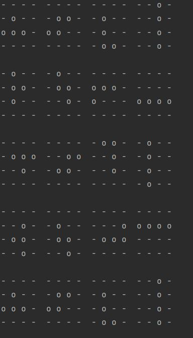

# Tetris

Tetris is a Java Program witch rotates a 4x4 Matrix.

## Visual

## Usage

There is Block class where the multidimensional array is saved.
This class has a method to rotate the matrix.
The Tetris class then has the method to print out 4 4x4 matrixes line by line.

## Support

If Questions come up feel free to contact me: ***stefan.bicha@gmx.at***

## Exercises

+ [Exercise1](exercise1.md)