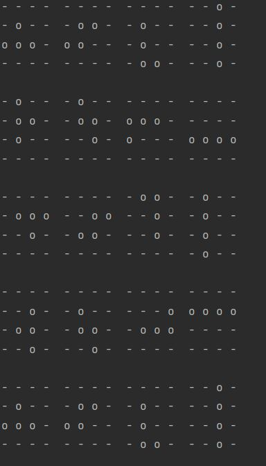

# Heading 1 Image

## Heading 2 Link

[Link to Wikipedia](https://de.wikipedia.org/wiki/Markdown)

### Heading 3 Paragraph

> This is the first sentence of a multiple line Paragraph
> 
> And this the second with an empty row
> 
> And another one\
> Next Line